<div align="center">



</div>

---

<div align="center">

```
// stack
```

<table>
<tr>
<td align="center" width="90">
<br>
<sub><b>TypeScript</b></sub>
</td>
<td align="center" width="90">
<br>
<sub><b>Next.js</b></sub>
</td>
<td align="center" width="90">
<br>
<sub><b>React</b></sub>
</td>
<td align="center" width="90">
<br>
<sub><b>PostgreSQL</b></sub>
</td>
<td align="center" width="90">
<br>
<sub><b>Prisma</b></sub>
</td>
<td align="center" width="90">
<br>
<sub><b>Tailwind</b></sub>
</td>
</tr>
<tr>
<td align="center" width="90">
<br>
<sub><b>Vercel</b></sub>
</td>
<td align="center" width="90">
<br>
<sub><b>Git</b></sub>
</td>
<td align="center" width="90">
<br>
<sub><b>VS Code</b></sub>
</td>
<td align="center" width="90">
<br>
<sub><b>Node.js</b></sub>
</td>
<td align="center" width="90">
<br>
<sub><b>Postman</b></sub>
</td>
<td align="center" width="90">
<br>
<sub><b>Pytest</b></sub>
</td>
</tr>
</table>

</div>

---

<div align="center">

```
// stats
```

[](https://git.io/streak-stats)

[](https://github.com/bexultvn)

[](https://github.com/bexultvn)

</div>

---

<div align="center">

```
// contact
```

[](https://t.me/bxtn_dev)
[](https://github.com/bexultvn)

</div>
